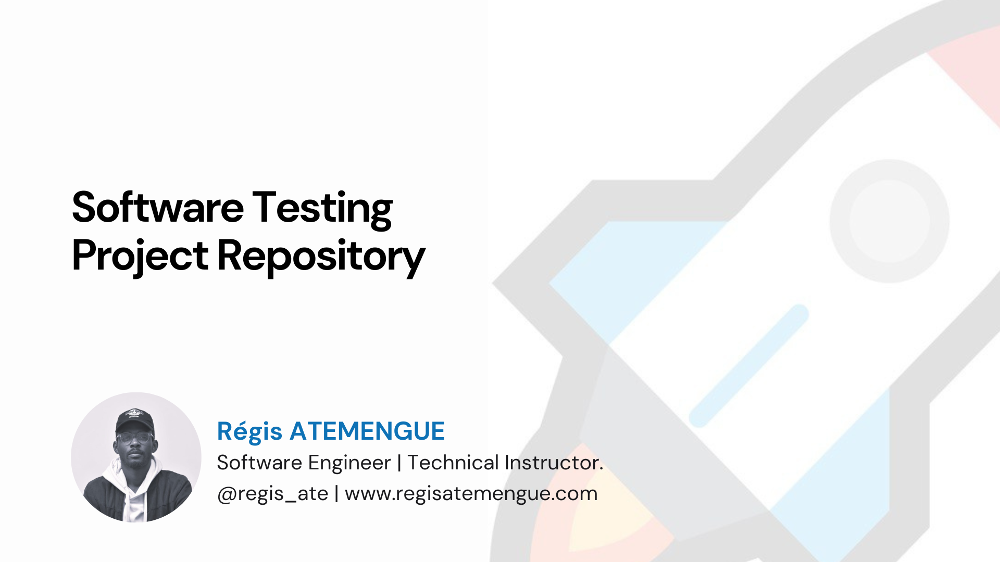

<!-- Improved compatibility of back to top link: See: https://github.com/othneildrew/Best-README-Template/pull/73 -->

<!--
*** Thanks for checking out the Best-README-Template. If you have a suggestion
*** that would make this better, please fork the repo and create a pull request
*** or simply open an issue with the tag "enhancement".
*** Don't forget to give the project a star!
*** Thanks again! Now go create something AMAZING! :D
-->

<!-- PROJECT SHIELDS -->
<!--
*** I'm using markdown "reference style" links for readability.
*** Reference links are enclosed in brackets [ ] instead of parentheses ( ).
*** See the bottom of this document for the declaration of the reference variables
*** for contributors-url, forks-url, etc. This is an optional, concise syntax you may use.
*** https://www.markdownguide.org/basic-syntax/#reference-style-links
-->

<!-- PROJECT LOGO -->
 

  <!--  -->

  <h3 align="center">Software Testing Repository</h3>

<!-- TABLE OF CONTENTS -->

  
Table of Contents

  <ol>
    <li>
      <a href="#about-the-project">About The Project</a>
      <ul>
        <li><a href="#built-with">Built With</a></li>
      </ul>
    </li>
    <li>
      <a href="#getting-started">Getting Started</a>
      <ul>
        <li><a href="#prerequisites">Prerequisites</a></li>
        <li><a href="#installation">Installation</a></li>
      </ul>
    </li>
    <li><a href="#usage">Usage</a></li>
    <li><a href="#roadmap">Roadmap</a></li>
    <li><a href="#contributing">Contributing</a></li>
    <li><a href="#license">License</a></li>
    <li><a href="#contact">Contact</a></li>
    <li><a href="#acknowledgments">Acknowledgments</a></li>
  </ol>

<!-- ABOUT THE PROJECT -->
## About The Project

    

<!-- [![Product Name Screen Shot][product-screenshot]](https://example.com)s -->

Our GitHub repository is a curated collection of open-source projects tailored for bachelor student in software testing. Dive into basics concepts of software tesing, explore unit testing and differents concepts, and collaborate with peers on real-world projects. From unit tesing to end to end testing, our repository provides resources to deepen your understanding and hone your skills in software  testing. 

each branch is dedicated to a specific group of bachelor's students in software engineering. This setup ensures that only members of a particular group can push code to their assigned branch, facilitating focused collaboration and project management. With separate branches for each group, students can work on their tasks without interference from others, fostering a streamlined workflow and clearer version control. This approach promotes effective teamwork within each group, allowing them to iterate on code and contribute to the project with confidence

(<a href="#readme-top">back to top</a>)

### Built With

<!-- This section should list any major frameworks/libraries used to bootstrap your project. Leave any add-ons/plugins for the acknowledgements section. Here are a few examples.

* [![Next][Next.js]][Next-url]
* [![React][React.js]][React-url]
* [![Vue][Vue.js]][Vue-url]
* [![Angular][Angular.io]][Angular-url]
* [![Svelte][Svelte.dev]][Svelte-url]
* [![Laravel][Laravel.com]][Laravel-url]
* [![Bootstrap][Bootstrap.com]][Bootstrap-url]
* [![JQuery][JQuery.com]][JQuery-url] -->

(<a href="#readme-top">back to top</a>)

<!-- GETTING STARTED -->
## MEMBRE DU GROUPE 6

ATANAGANA JEAN PIERRE                21Q2529
MATAGANG TENEFOSSO EMMANUELLA     	 21Q2443
NYAMI TCHOUMBA KEVINE MALONE         21Q2515
TATSAMBONG SOUANFO FRANCK 	    		 21Q2409
MANFO LEO                            23V2657
